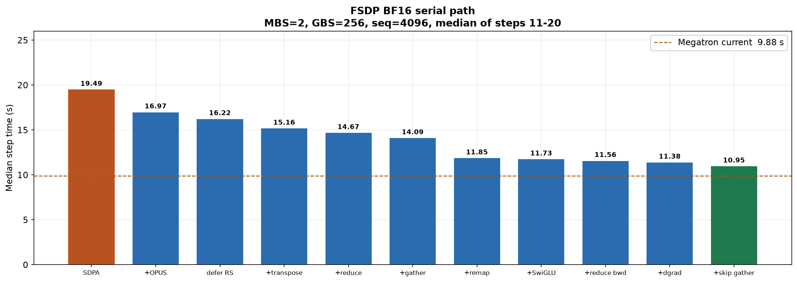
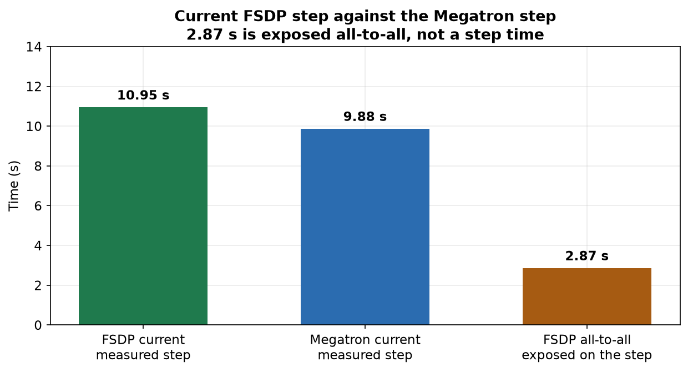

# Qwen3-30B-A3B FSDP BF16 优化过程

Megatron combined 1F1B 见 [`qwen3-30b-a3b-bf16-megatron-optimization.md`](qwen3-30b-a3b-bf16-megatron-optimization.md)。

8×MI350X 上，Qwen3-30B-A3B FSDP BF16 预训练（MBS=2，GBS=256，seq=4096，steps 11–20 中位数）从 **19.49 s / 13.14 samples/s** 降到 **10.95 s / 23.38 samples/s**（−8.54 s，−43.8%，1.78×）。同一形状的 Megatron 是 9.88 s，还差约 **1.07 s**，主要是串行 schedule 上暴露的 expert all-to-all。

## 1. 口径

Qwen3-30B-A3B：48 层，hidden 2048，128 experts，top-8，expert FFN 768。栈是 Transformers + FSDP2 + SonicMoE（Triton grouped GEMM）+ AITER attention。world=8，EP=8，expert DP=1，dense DP=8。BF16 计算，fp32 master。`shard_grad_op` 把参数留在累积窗口里，只在最后一个 microbatch reduce-scatter。专家 GEMM 保持 Triton。

数字都是真实权重加 FineWeb 的 20 步日志，steps 11–20 中位数，samples/s = 256 / 中位秒。`TRAIN_STEPS` 必须是 20，否则样本顺序会变。步时噪声大约 50–100 ms。这条是串行 schedule：dispatch 等 router，combine 加回 residual 之后下一层 attention 才开始。gather-reduce 之后 step 1 锁在 lm loss **2.561523**、grad_norm **6.727**。step 20 lm loss 在 2.384 附近。Megatron 换上 FlyDSL 之后的 step 20 是 2.410，两边只比墙钟。

## 2. 优化过程

每一行叠在上一行上，形状始终是 MBS=2、GBS=256。

| 阶段 | 做了什么 | 中位 (s) | samples/s | 相对上一步 | step 20 lm loss |
|---|---|---|---|---|---|
| **起点** | Sonic global layout，`shard_grad_op`。attention 实际是 PyTorch SDPA | 19.49 | 13.14 | — | 2.384705 |
| **OPUS attention** | OPUS 前向 + `fmha_v3` atomic16 反向 | 16.97 | 15.09 | −2.52 s | 2.384460 |
| **推迟 reduce-scatter** | 累积窗口内推迟 FSDP reduce-scatter | 16.22 | 15.79 | −0.75 s | 2.384766 |
| **融合 transpose** | layout transpose 改走 TE `moe_sort_chunks_by_index` | 15.16 | 16.88 | −1.05 s | 2.384827 |
| **gather-reduce** | combine 改成 gather-reduce，去掉 `index_add_` | 14.67 | 17.45 | −0.49 s | 2.385010 |
| **token gather** | Dispatch 反向改成无原子的 token gather | 14.09 | 18.17 | −0.59 s | 2.384460 |
| **专家放置** | 按层置换专家，把 EP 负载拉平 | 11.85 | 21.60 | −2.23 s | 2.384460 |
| **SwiGLU 前向** | up-projection 与 SwiGLU 前向合成一个 kernel | 11.73 | 21.83 | −0.13 s | 2.384827 |
| **reduce 反向** | token-reduce 反向一次读 `grad_out` | 11.56 | 22.14 | −0.17 s | 2.384644 |
| **SwiGLU 反向** | SwiGLU 反向融进 down-projection dgrad | 11.38 | 22.50 | −0.19 s | 2.384338 |
| **跳过恒等 gather** | 跳过恒等 gather 和全 1 score 乘法 | **10.95** | **23.38** | −0.43 s | 2.384644 |

**起点（19.49 s）。** Sonic grouped experts、expert-major dispatch、Lumen RMSNorm、`shard_grad_op`、无 gradient checkpoint。同一代码上 full shard 是 19.76 s。当时 `run_fsdp.sh` 没有把 `AITER_ATTN=1` 转成 `--aiter-attn`，attention 一直是 PyTorch AOTriton SDPA。

**OPUS attention（19.49 → 16.97 s）。** `hf_patch.py` 按 `LUMEN_ATTN_BACKEND` 选 kernel。csrc 的 `fmha_v3` 前后向是 17.28 s，step 20 loss 与起点的 2.384705 相同。留下的是 OPUS 前向加 atomic16 反向，单层前后向 1.77 → 1.34 ms。开关 `AITER_ATTN=1`、`LUMEN_ATTN_BACKEND=opus`、`LUMEN_ATTN_BWD_ATOMIC_FP32=0`。

**推迟 reduce-scatter（16.97 → 16.22 s）。** 累积窗口里参数保持未分片，只在最后一个 microbatch 做 reduce-scatter。峰值从 137.5 GiB 升到 142.5 GiB。`SHARDING=shard_grad_op`。

**融合 transpose（16.22 → 15.16 s）。** 进出专家的 `transpose_variable_chunks` 原先 `.tolist()`，把计算 stream 排空。改成 `fused=True`，走 TE `moe_sort_chunks_by_index`。

**gather-reduce（15.16 → 14.67 s）。** combine 回来的行按 token 重复。`index_add_` 大约 0.36 s 露在关键路径上。改成每个 token 把 top-k 行 gather 出来再加权求和。step 1 从这里起是 2.561523 / 6.727。峰值降到 130.5 GiB，反向不再保存 `returned * weight`。

**token gather（14.67 → 14.09 s）。** Dispatch 把每个 token 复制到 top-k 个槽，反向原来用原子 scatter 加回去，改成这些槽直接求和。这一档 profile：计算占住 GPU 8.38 s，expert all-to-all 5.19 s，重叠是 0。等长 dispatch 合计 1.50 s，不等长 combine 合计 3.70 s。

**专家放置（14.09 → 11.85 s）。** 连续切分时每层都有一个稳定的重 rank，token 大约是均值的 1.49 倍。按层把 128 个专家重排成每 rank 16 个之后，这个比例降到约 1.02，最重 rank 的 token 降到原来的约 68%。只置换专家 id，token 仍进原来的专家，step 1 不变。这是整段里最大的一档，少掉的主要是不均衡 combine 的长尾。开关 `LUMEN_EXPERT_REMAP=1`，默认关闭。放置之后的 profile：all-to-all 2.87 s，和计算只叠了 83 ms。

**SwiGLU 前向（11.85 → 11.73 s）。** up-projection 在同一个 kernel 里写出 BF16 激活并算出 SwiGLU。真实路由分数仍在 Sonic 外面乘，FSDP 传进去的是 `torch.ones`。开关 `LUMEN_EXPERT_FUSED_SWIGLU=1`，docker 默认开，grouped backend 为 triton。

**reduce 反向（11.73 → 11.56 s）。** 专家输出和路由分数都要梯度时，原来把 `grad_out` 读两遍。合成一次读，归约宽度 256，和拆开的 kernel 逐位相同。孤立反向大约 0.477 → 0.253 ms。

**SwiGLU 反向（11.56 → 11.38 s）。** down-projection 的 epilogue 里重算 SwiGLU 并写出 `dh`，去掉单独的 `_glu_bwd_kernel`（当时 239 ms）。分数梯度的点积仍在 kernel 外面。与 SwiGLU 前向同一个开关。

**跳过恒等 gather（11.38 → 10.95 s）。** pre-routed 的 gather 下标是 `arange`，kernel 里的 score 是 1。dgrad 和 wgrad 各做一次 `dout[x_gather_idx]`，再乘全 1 把 bf16 抬到 fp32。下标连续时直接用 `dout`；`scores_are_one=True` 时跳过乘法，wgrad 读 bf16，字节少一半。这个标志只在 FSDP 那次 `moe_pre_routed_inputs` 上。step 1 仍是 2.561523 / 6.727，step 20 lm loss 2.384644，grad_norm 0.420，峰值 132016 MB。steps 11–20 排序后中位数 10951.8 ms。

当前最快日志：`examples/qwen3-30b-a3b/results/qwen3-30b-a3b-fsdp-sonic-identity-gather-bf16-seq4096-mbs2-gbs256.log`。

## 3. 没有留下的

留下的标准是：steps 11–20 中位数要明显快过当时的串行基线，并且 step 1 的 lm loss / grad_norm 对齐。差在 50–100 ms 里的算作打平。

| 尝试 | 结果 |
|---|---|
| 跨 microbatch 重叠 expert all-to-all，并重算专家 | 相对 19.49 s 是 19.71 s。峰值约 213 GiB，重算大约 3 s |
| 同一重叠、不重算专家 GEMM | 相对 14.09 s，第 2 步峰值约 235 GiB 后 OOM。没崩的步是 22–28 s。step 1 lm loss 2.561768 |
| 反向跨 microbatch 重叠 | 第 1 步 grad_norm 6.187，低于串行 6.727。第 2 步 OOM。代码已从树里去掉 |
| 跳过恒等 gather 之后再重叠，attention 改成反向重算 | 能跑完，峰值 193 GiB，中位数 **15.45 s**。step 1 是 2.562012 / 6.731。重叠路径的 combine 仍是 BF16 `index_add_`。开关 `LUMEN_FSDP_MB_OVERLAP` 保持默认关 |
| split 在侧流 D2H | 19.49 s 对 19.47 s |
| 专家 GEMM 换 FlyDSL | 相对 14.09 s 是 14.41 s，峰值多约 22 GiB。FSDP 仍用 Triton |
| K 的 RMSNorm 改回 PyTorch | 14.34 s。K 只有 Q 的 1/8 行 |
| hipBLASLt grouped GEMM | BF16 没有可用算法 |
| wgrad tile | 相对 11.85 s 是 11.91 s |
| 重写 chunk transpose | 13.70 s 和 11.90 s，都没有超过当时的 11.85 s。仍走 TE sort |
| 专家 wgrad 放到侧流去盖 all-to-all | all-to-all 从 2.87 s 增到 3.24 s，wgrad 从 1.01 s 增到 1.50 s。默认关闭 |
| 跳过 score 为 1 的 router gather | 相对 10.95 s 是 10.935 s，只少 17 ms。已回滚 |

## 4. 还差在哪里

当前 10.95 s 相对 Megatron 的 9.88 s 还差 1.07 s。专家放置之后 all-to-all 是 2.87 s，和计算只叠了 83 ms。从 SwiGLU 前向到跳过恒等 gather，计算少了约 0.90 s，通信量没变，这段通信仍然露在外面。

同一条 microbatch 里盖不住它：dispatch 的输入是 router 的输出，combine 的输出是下一层 residual 的输入。跨 microbatch 把两份激活放进显存的那次完整 20 步，是加上 attention 重算之后的 15.45 s，比 10.95 s 慢 4.5 s。

再往下、仍和 2.561523 对齐的 kernel 都在噪声下面。分数梯度的点积是几十毫秒。token gather 自身约 184 ms，换成更快的索引拷贝，上限不到 100 ms。router gather 已经在 10.95 s 这档上测过，中位数只动了 17 ms。

| | FSDP 当前（跳过恒等 gather） | Megatron 当前（dQ atomic16） |
|---|---|---|
| 中位 step | 10.95 s | 9.88 s |
| samples/s | 23.38 | 25.92 |
| expert GEMM | Triton grouped | FlyDSL |
| all-to-all | 串行，约 2.87 s 暴露 | combined 1F1B，通信流盖在另一条 microbatch 后面 |
| step 20 lm loss | 2.384644 | 2.410280 |
