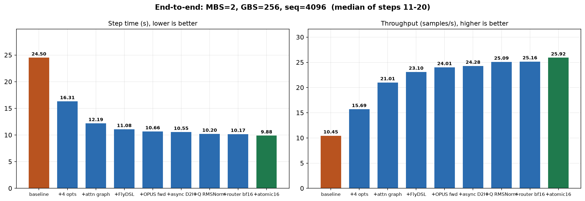
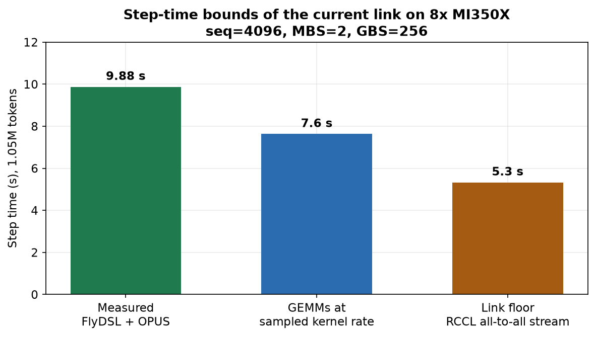

# Qwen3-30B-A3B Megatron BF16 优化过程

FSDP 串行路径见 [`qwen3-30b-a3b-bf16-fsdp-optimization.md`](qwen3-30b-a3b-bf16-fsdp-optimization.md)。

8×MI350X 上，Qwen3-30B-A3B Megatron BF16 预训练（MBS=2，GBS=256，seq=4096，steps 11–20 中位数）从 **24.50 s / 10.45 samples/s** 降到 **9.88 s / 25.92 samples/s**（−59.7%，2.48×）。

## 1. 口径

Qwen3-30B-A3B：48 层，hidden 2048，128 experts，top-8，expert FFN 768。栈是 Megatron-LM + Lumen + SonicMoE，TP=PP=CP=1，EP=8。SonicMoE 只替换 `MoELayer.experts`，router、permute 和 EP all-to-all 仍是 Megatron。

数字都是真实权重加 FineWeb 的 20 步日志，steps 11–20 中位数，samples/s = 256 / 中位秒。前 3 步含加载和 autotune，不进统计。

换 FlyDSL 之前，step 20 lm loss 在 2.385 附近。换上 FlyDSL 之后 step 1 仍是 2.562，step 20 变到 2.410；后面每一档都在 2.41028–2.41032。

## 2. 优化过程

每一行叠在上一行上，形状始终是 MBS=2、GBS=256。

| 阶段 | 做了什么 | 中位 (s) | samples/s | 相对上一步 | step 20 lm loss |
|---|---|---|---|---|---|
| **起点** | Triton attention + hipBLASLt multistream，无 EP overlap，无 CUDA graph | 24.50 | 10.45 | — | 2.3860 |
| **四项基础** | CK attention、Triton grouped GEMM、EP overlap、`CONN=8` | 16.31 | 15.69 | −8.19 s | 2.3848 |
| **attention graph** | 只把 attention 放进 CUDA graph | 12.19 | 21.01 | −4.13 s | 2.3848 |
| **FlyDSL** | 专家 GEMM 换 FlyDSL | 11.08 | 23.10 | −1.11 s | 2.4103 |
| **OPUS 前向** | Attention 前向换 OPUS | 10.66 | 24.01 | −0.42 s | 2.4103 |
| **异步 split** | All-to-all 的 split 列表改成异步 D2H | 10.55 | 24.28 | −0.12 s | 2.4103 |
| **Q RMSNorm** | Q 的 RMSNorm 换 Triton | 10.20 | 25.09 | −0.34 s | 2.4103 |
| **router 反向** | Router 反向用 bf16 输入 | 10.17 | 25.16 | −0.03 s | 2.4103 |
| **dQ atomic16** | Attention 反向 dQ 用 16-bit atomic | **9.88** | **25.92** | −0.30 s | 2.4103 |

**四项基础（24.50 → 16.31 s）。** 大 batch 没有逐项重测，相对大小来自小 batch（MBS=1，GBS=16，steps 4–10 中位数，2.27 → 1.57 s）：

| 累加项 | 小 batch 中位 | 相对上一步 |
|---|---|---|
| Attention 换成 AITER CK `fmha_v3` | 1.94 s | −14.5% |
| Grouped GEMM 换成一个 Triton kernel | 1.72 s | −11.3% |
| 打开 combined 1F1B，跨 microbatch 盖 EP all-to-all | 1.62 s | −5.8% |
| `CUDA_DEVICE_MAX_CONNECTIONS` 从 1 改到 8 | 1.57 s | −3.1% |

CK 在真实 GQA 形状上前向 1.03 → 0.17 ms，反向 3.21 → 0.68 ms。Triton grouped GEMM 把每层 6 个 GEMM 从 2.30 ms 收到 1.78 ms；原先每个 expert 单独 launch。同层同 microbatch 里 dispatch 和专家 GEMM 有数据依赖，只能用另一条 microbatch 的计算去盖 all-to-all，所以 microbatch 不能退成 1。镜像里 connections 写死为 1，计算流和通信流排在同一个队列，overlap 发了也跑不起来；硬件队列上限是 8。

**attention graph（16.31 → 12.19 s）。** 只捕获 attention 子图。MoE 的 token 数每步都变，专家不进 graph。`CUDA_GRAPH_SCOPE=attn` 可以和 EP overlap 一起开。

**FlyDSL（12.19 → 11.08 s）。** 专家 GEMM 改吃已经按专家排好的 BF16 行。主要收益在反向，单次大约 4.9 ms 降到 3.1 ms。这部分计算有一部分已经和另一条 microbatch 的 all-to-all 叠在一起，所以 kernel 变快不会 1:1 变成墙钟。开关 `SONIC_MOE_GEMM_BACKEND=flydsl`。

**OPUS 前向（11.08 → 10.66 s）。** 前向换成 OPUS 的 gfx950 GQA kernel，反向继续用 `fmha_v3_bwd`。开关 `LUMEN_ATTN_BACKEND=opus`。

**异步 split（10.66 → 10.55 s）。** RCCL 启动 all-to-all 前要 host 上的 split 列表，原来在关键路径上 `hipEventSynchronize`。改成 permute 期间用侧流拷贝，启动前事件已经完成就不再等。

**Q RMSNorm（10.55 → 10.20 s）。** Q 有 262144 行，Triton 大约 0.21 ms，ATen 大约 0.59 ms。K 只有 32768 行，Triton 更慢，K 留在 ATen。开关 `LUMEN_QK_RMSNORM=1`。

**router 反向（10.20 → 10.17 s）。** logits 仍是 fp32。反向不再先把 [8192, 2048] 的激活 cast 成 fp32，改成 bf16 输入、fp32 累加。单次大约 141 µs 降到 53 µs，大部分已被别的计算盖住。开关 `LUMEN_ROUTER_BWD_BF16=1`。

**dQ atomic16（10.17 → 9.88 s）。** Attention 反向按 block 写出部分 dQ，再原子加到一起。改成 16-bit atomic，GEMM 精度和 dK/dV 不变。单层 1.38 → 0.96 ms，step 20 loss 2.410312 → 2.410280。开关默认关闭，要设 `LUMEN_ATTN_BWD_ATOMIC_FP32=0`。

当前最快日志：`examples/qwen3-30b-a3b/results/qwen3-30b-a3b-sonic-flydsl-opus-attnbwda16-mbs2-gbs256-seq4096-mbs2-gbs256.log`（中位 9.875 s）。

## 3. 没有留下的

| 尝试 | 结果 |
|---|---|
| Gradient-accumulation fusion | 10.707 s，比当时的 10.661 s 更慢 |
| 残差加进下一层 RMSNorm | loss 对齐后 10.90 s |
| K 也换 Triton RMSNorm | 行数只有 Q 的 1/8，比 ATen 慢 |
| 同一层把专家 GEMM 切块，去叠本层 all-to-all | 第一步 GPU 内存错误，代码已删 |
| `--delay-wgrad-compute` | 本栈是 local transformer，启动即 assert，没有性能数 |
| IPC 可变长 all-to-all | 大约 29 s/步 |
| MORI fused dispatch、RCCL channel / 协议扫描 | 没有快过基线 |
| Expert counts 留在 GPU | 小 batch 1.569 s 对 1.567 s |
| Pad 到 expert capacity | 更快，但 loss 从 2.45 变到 2.74 |
| FP8 blockwise 专家 GEMM | 12.95 s，step 20 lm loss 2.413，是另一条数值路径 |

## 4. 还差在哪里

9.88 s 里面，专家 GEMM 相对已经测过的孤立 kernel 速率还剩大约 **2.25 s**。扣掉之后 step 是 **7.6 s**。短桶 wgrad 现在只有 46–56 TFLOP/s，采样的均衡形状是 462–730 TFLOP/s；7.6 s 成立的条件是这些分桶 kernel 也能跑到采样速率。

再往下是 all-to-all 通信流自己的 **5.3 s**（4608 次 `all_to_all`，平均 1.16 ms，在同一条 EP 流上）。计算链短于 5.3 s 之后，墙钟停在这里。channels、MSCCL、MORI、IPC 都没有把这段缩短。
